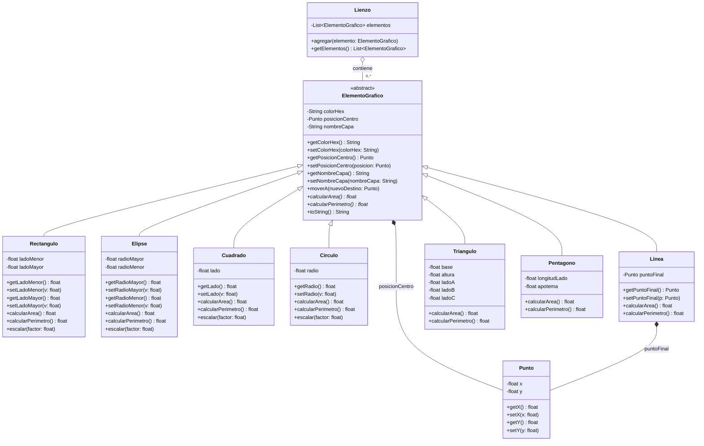

# TP5 — Diagrama de Clases (UML)

## Punto 6 — Estructura final mejorada

Refleja la arquitectura final del motor de renderizado: `ElementoGrafico`
como clase abstracta (Punto 5), la solución del "Dilema del Cuadrado"
(`Cuadrado` heredando directo de `ElementoGrafico`, sin pasar por
`Rectangulo`, para no violar LSP — Punto 3), y las clases nuevas pedidas
por la consigna: `Linea`, `Triangulo` y `Pentagono`.

---

## 

- **`ElementoGrafico <|-- Rectangulo/Elipse/Cuadrado/Circulo/Linea/Triangulo/Pentagono`**
  Herencia (generalización): triángulo vacío apuntando a la superclase.
  Las siete heredan directo de `ElementoGrafico` — ninguna herencia de
  dos niveles en la versión final.

- **`Cuadrado` y `Circulo` cuelgan directo de `ElementoGrafico`, no de
  `Rectangulo`/`Elipse`**
  Corrección del Punto 3: al principio se probó `Cuadrado(Rectangulo)` y
  `Circulo(Elipse)`, sobrescribiendo `setLadoMenor/setLadoMayor` y
  `setRadioMayor/setRadioMenor` respectivamente para forzar que ambos
  valores cambien juntos. Ese patrón "funciona" pero viola LSP en los dos
  casos por igual: la subclase rompe la promesa de independencia que la
  superclase le da a sus clientes. La versión final resuelve ambos casos
  de la misma forma — heredando directo de `ElementoGrafico` con un único
  atributo (`lado` y `radio` respectivamente) — para no heredar ninguna
  promesa que después haya que romper. Por eso el diagrama **no** incluye
  las relaciones `Rectangulo <|-- Cuadrado` ni `Elipse <|-- Circulo`: esas
  corresponden a la versión con la violación de LSP, ya descartada.

- **`ElementoGrafico *-- Punto`**
  Composición: todo `ElementoGrafico` tiene su propio `Punto` como
  `posicionCentro`, sin sentido de existir fuera de la figura que lo
  contiene.

- **`Linea *-- Punto : puntoFinal`**
  Además del `posicionCentro` heredado (punto de inicio), `Linea` necesita
  un segundo `Punto` para el destino del segmento.

- **`Lienzo o-- "0..*" ElementoGrafico`**
  Agregación: el `Lienzo` contiene una colección de figuras, pero esas
  figuras podrían existir de forma independiente del lienzo — relación más
  "floja" que la composición. La cardinalidad `"0..*"` indica que el
  lienzo puede tener cero o muchas figuras.

---

## Sobre `Linea`, `Triangulo` y `Pentagono`

Agregadas al diagrama según pide la consigna del Punto 6:

- **`Linea`**: se define por dos puntos (inicio heredado + `puntoFinal`
  propio). `calcularArea()` devuelve `0.0` (un segmento no encierra
  superficie, pero debe implementar el método por el contrato abstracto).
  `calcularPerimetro()` devuelve la distancia entre los dos puntos.
- **`Triangulo`**: `base` y `altura` para el área (`base × altura / 2`), y
  los tres lados (`ladoA`, `ladoB`, `ladoC`) para el perímetro.
- **`Pentagono`**: `longitudLado` y `apotema` → área con
  `(perímetro × apotema) / 2`, perímetro con `5 × longitudLado`
  (pentágono regular).