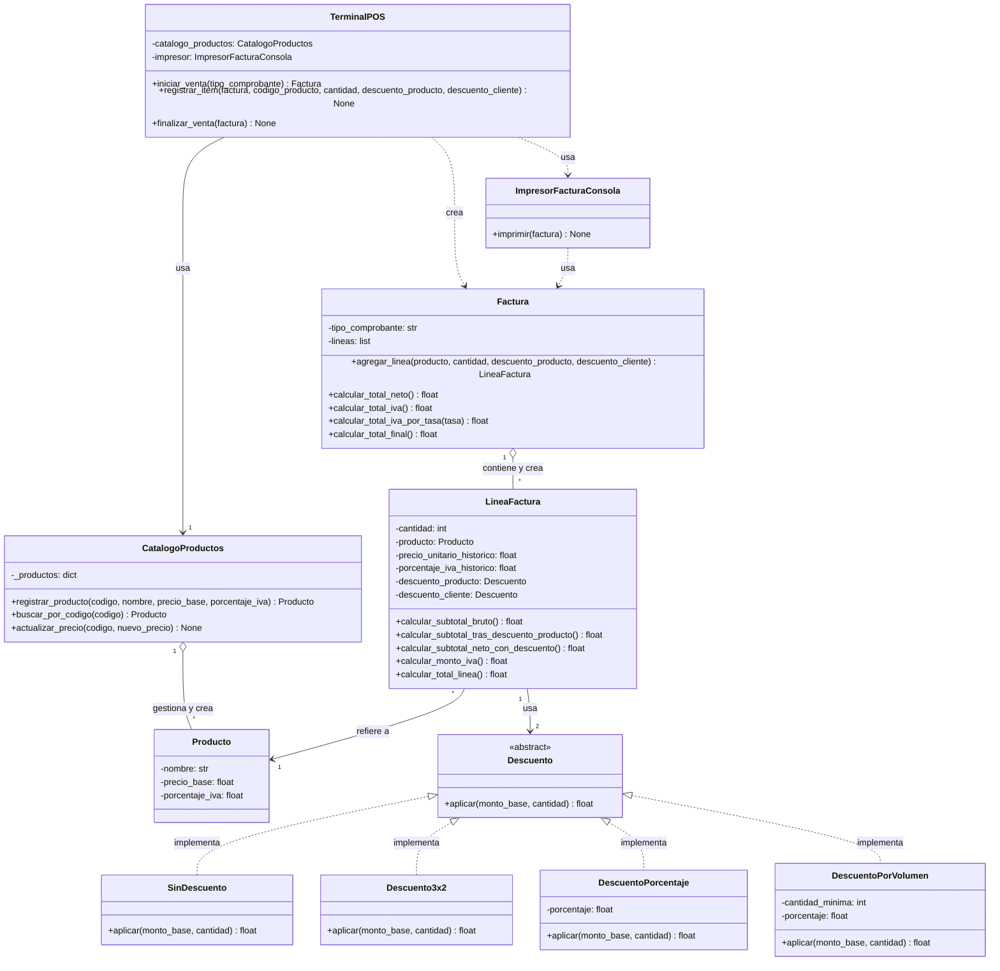

## Notas de diseño

- **Atributos históricos (Parte 1, Punto 1):** `LineaFactura` guarda `precio_unitario_historico` y `porcentaje_iva_historico`, copiados de `Producto` en el momento de la venta. No hay ninguna flecha entre `Factura` y `Producto` directamente.
- **Ley de Demeter (Parte 1, Punto 2):** `Factura` solo se relaciona con `LineaFactura`. Es `LineaFactura` quien se relaciona con `Producto`, no `Factura`.
- **Fabricación Pura (Parte 2, Punto 4):** `ImpresorFacturaConsola` no representa ningún concepto del negocio de facturación; existe únicamente para resolver la presentación por consola.
- **Polimorfismo de descuentos (Parte 3, Punto 8):** `Descuento` es abstracta, con cuatro implementaciones concretas. `LineaFactura` recibe DOS descuentos (`descuento_producto` y `descuento_cliente`), aplicados en cadena, siguiendo la granularidad definida en el Punto 6 (descuentos de producto a nivel línea, descuentos de cliente/volumen también inyectados por línea para preservar la matemática del IVA por tasa).
- **Patrón Creador (Parte 4, Punto 9):** `Factura` crea sus propias `LineaFactura` (método `agregar_linea`), `TerminalPOS` crea la `Factura`, y `CatalogoProductos` crea y gestiona los `Producto`.